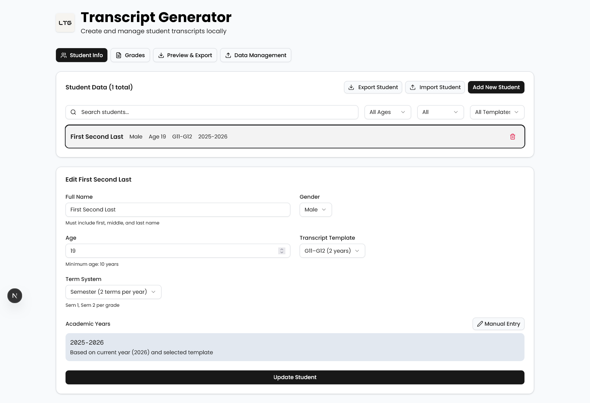
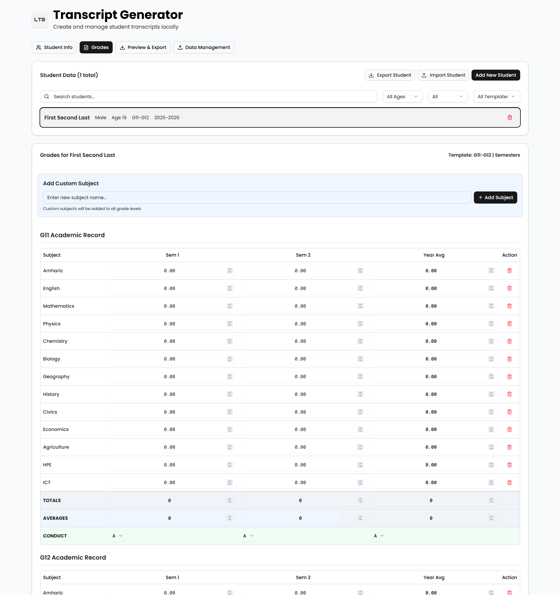
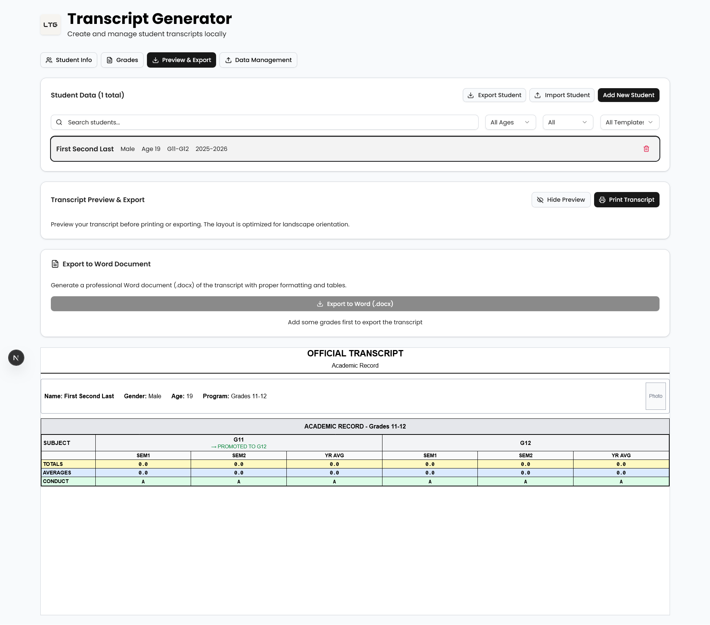

# Local Transcript Generator

A local web app for automating student transcript creation, preview and printing for schools.


## Why This Exists

I built this after watching my teacher struggle to print my transcript correctly. The school staff were using different Microsoft Word templates for each grade level (G9-G12, G10-G12, etc.), manually copying student data between files and unorganized file structure. Mistakes were common and the process was painfully slow.

This app replaces that workflow with a single tool that handles all grade templates, stores student records locally, and exports print-ready transcripts in one click.





## Features

- Grade-specific templates (G9-G12, G10-G12, G11-G12, G12) that automatically adapt the input form
- Student records saved locally in the browser with no backend or internet required
- Print-ready transcript preview that matches the school's official format
- One-click export to Word document (.docx) for printing or sharing
- JSON export and import for backing up or transferring student data between machines
- Search and filter to quickly find students across saved records

## Getting Started

### Prerequisites

- Node.js (version 18 or higher)

### Installation

```bash
git clone https://github.com/94YDanielY94/LocalTranscriptGenerator.git
cd LocalTranscriptGenerator
bun install
bun run dev
```

Open the app at [http://localhost:3000](http://localhost:3000).

### Production Build

```bash
bun run build
bun start
```

## How It Works

1. Create a new student record with their name, gender, age, and grade template
2. Switch to the Grades tab and enter academic scores by subject and semester
3. Use the Preview tab to see the formatted transcript exactly as it will print
4. Export as a Word document or print directly from the browser
5. Use Data Management to export all records as JSON (for backup) or import from another machine

All data is stored in your browser's localStorage. Nothing is sent to any server.

## License

[MIT](LICENSE)

See [CONTRIBUTING.md](CONTRIBUTING.md) for development setup and contribution guidelines.